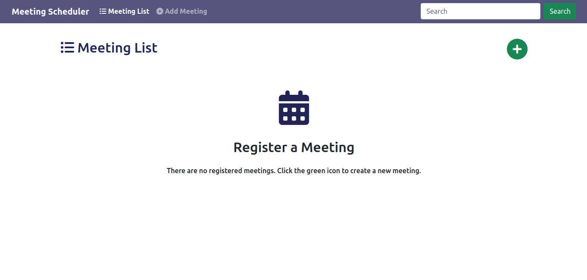

# :necktie: Meeting Scheduler

---

## :book: Introduction

This application provides a system to manage meetings, being able to register a meeting by its date, start time, and end time. It also updates meeting information after its creation and deletes it if desired.

Check the backend repository of this app _[here](https://github.com/jonviegas/meeting-scheduler_api)_.

---

## :iphone: Application

The project is hosted on Github Pages, _[click here](https://jonviegas.github.io/meeting-scheduler-frontend/)_ to access it.

---

## :computer_mouse: Usage

\
  
